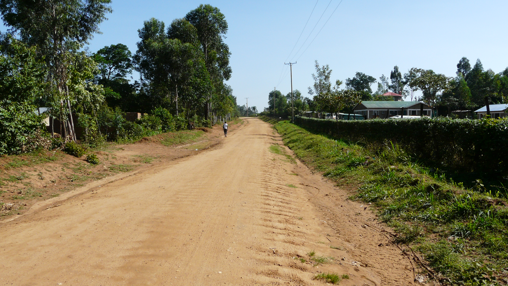

# Enhancing Road Infrastructure Management through Computer Vision

## Deep Learning for Road Condition Classification

This project aims to revolutionize road infrastructure management by developing an automated road condition classification system using computer vision and deep learning methodologies. This technology is designed to benefit stakeholders involved in road maintenance and management, such as government agencies, road maintenance authorities, and civil engineers. By automating the process of road condition assessment, the project seeks to enhance efficiency, reduce costs, and improve decision-making processes. 

## Table of Contents

- [Introduction](#introduction)
- [Methodology](#methodology)
- [Model Comparison](#model-comparison)
- [Model Deployment](#model-deployment)
- [Conclusion](#conclusion)
- [Recommendations](#recommendations)
- [Contributors](#contributors)

## Introduction

### Overview

Our project leverages computer vision and deep learning to automate the assessment of road conditions, enhancing efficiency, reducing costs, and improving decision-making processes within road infrastructure management.

## Tech Stack

- **Python**: Programming language used for the project.
- **Power BI**: Visualization tool used for the interactive dashboard report. 
- **TensorFlow and Keras**: For building and training deep learning models.
- **OpenCV**: Used for image processing tasks.
- **Pandas and NumPy**: For data manipulation and numerical computations.
- **Matplotlib**: For data visualization and exploratory data analysis.
- **Streamlit**: For deploying the model and providing a web-based user interface.
- **AWS S3**: For hosting the road dataset and allowing public access.
- **Git**: For version control.
- **GitHub**: For repository hosting and collaboration.

### Business Problem

Manual road condition assessment methods, such as the Road Inventory and Condition Survey (RICS), are labor-intensive and prone to delays and inaccuracies. These challenges hinder effective maintenance planning and resource allocation, impacting road safety and transportation efficiency. Automating road condition assessment using computer vision can streamline the process, improve accuracy, and enable timely interventions. To illustrate the substantial scope of the survey, the team developed this [interactive dashboard](https://bit.ly/4a69As2) showcasing Kenya's extensive road network as managed by various Road Agencies i.e. KeNHA, KeRRA, KURA, and County Governments. 

### Objectives

- Develop an automated road condition classification system using computer vision and deep learning.
- Identify an optimal deep learning model architecture for accurately classifying road conditions
- Evaluate the impact of data augmentation on model performance and generalizability.
- Assess the effectiveness of transfer learning from pre-trained models in enhancing road condition classification.
- Analyze socio-economic impacts and policy implications of the automated system.

## Methodology

### Data Collection

Images of roads in varying conditions are scraped from various regions worldwide. The images are manually categorized into five categories: Good, Fair, Poor, Flooded, and Unpaved.

### Exploratory Data Analysis (EDA)

A few roads from each of the categories are sampled to visually inspect the dataset's content. This step allows us to understand the visual representation of different road conditions and assess the diversity of the dataset.

  

    
    
Good Condition

  

  

    
    
Fair Condition

  

  

    
    
Poor Condition

  

  

    
    
Flooded Condition

  

  

    
    
Unpaved Road

  

### Data Preprocessing

Steps include:
- Incompatible image extensions such as GIF are eliminated.
- The pixel values of images are adjusted to fall within the range of 0 to 1, aiding model convergence during training.
- Images are resized to a consistent size of 224x224 pixels to maintain uniformity across our dataset.
- Data augmentation techniques like rotations, flips, and shifts are applied to enlarge the training dataset and prevent overfitting.

## Model Comparison

| SN.NO | Model Name                    | Test Loss | Test Accuracy | Test F1 Score | Test Precision | Test Recall | Training Time | Notes                                               |
|-------|-------------------------------|-----------|---------------|---------------|----------------|-------------|---------------|-----------------------------------------------------|
| 1     | Baseline Model                | 1.0663    | 59.01%        | 55.55%        | 63.36%         | 59.01%      | 28.42 mins    | Baseline configuration                              |
| 2     |CNN with Different Architecture| 1.3793    | 47.26%        | 36.71%        | 30.90%         | 47.26%      | 27.47 mins    | Added more layers to baseline CNN, may overfit      |
| 3     | VGG16 Model                   | 0.5673    | 77.28%        | 77.02%        | 77.87%         | 77.28%      | 33:29 mins    | Good generalization capabilities                    |
| 4     | Densenet Model                | 0.2688    | 91.12%        | 91.03%        | 91.24%         | 91.12%      | 30:54 mins    | Small size and accurate, excellent efficiency       |
| 5     | Tuned Densenet Model          | 0.3269    | 90.08%        | 90.02%        | 90.40%         | 90.08%      | 39:54 mins    | Fine-tuned with Early Stopping, optimized parameters|
| 6     | EfficientnetB0                | 1.5391    | 35.25%        | 18.37%        | 12.42%         | 35.25%      | 38:26 mins    | Struggled with complex road conditions              |
| 7     | EfficientnetB5                | 1.5378    | 35.25%        | 18.37%        | 12.42%         | 35.25%      | 38:27 mins    | Similar issues as B0, no improvement                |
| 8     | Resnet50                      | 1.3915    | 35.51%        | 18.92%        | 25.51%         | 35.51%      | 35:52 mins    | Underperformed in precision and recall              |
| 9     | NasnetLarge Model             | 0.2679    | 89.03%        | 88.97%        | 89.05%         | 89.03%      | 25:11 mins    | Shortest training time, highly efficient            |

## Model Deployment

To facilitate practical applications in real-world scenarios, the selected model is deployed using Streamlit. Streamlit provides a user-friendly interface for interacting with the model, ensuring smooth implementation and seamless integration into existing workflows. This deployment enables stakeholders to access and utilize the model's capabilities efficiently, empowering them to make informed decisions in road infrastructure management.

## Conclusion

This project demonstrates the power of deep learning in modernizing road condition assessments. By leveraging models like DenseNet, we replace manual methods with efficient automation, offering faster and more accurate results. Implementing this system can significantly impact road safety and reduce maintenance costs. Stakeholders gain access to timely and accurate data, enabling better decision-making for infrastructure management and offering a scalable, cost-effective solution with global implications for transportation infrastructure management.

## Recommendations

- **Integration with GIS:** Combine our road condition classification model with Geographic Information Systems technologies for real-time mapping and monitoring, aiding targeted maintenance.
  
- **Crowdsourced Data Collection:** Implement a crowdsourcing program to engage the public in gathering road condition images, complementing existing data collection efforts.

- **Policy Development with Analytics:** Utilize predictive analytics to inform policy decisions, enabling better planning for maintenance schedules and budget allocation.

- **Capacity Building:** Provide training sessions to enhance stakeholders' proficiency in using new technologies like GIS and crowdsourcing applications.

- **Partnerships for Innovation:** Collaborate with tech providers and academia.

## Contributors

- Lisa Maina
- Valerie Vinya
- Stephen Kariuki
- Wilkins Nzioka
- Colins Wanjao
